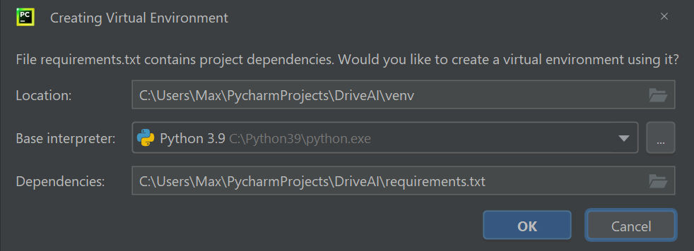
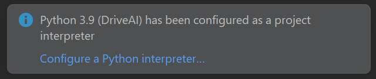

# NEAT Chrome Dino Game


<br>
<br>

**A.I. Learns to Drive** built in **Python** using **Pygame** and **NEAT Algorithm**! 🏎️

Made by [maxontech](https://twitter.com/max_on_tech)

## Table of contents

- [Description](#description)
- [YouTube Tutorial](#youtube-tutorial)
- [Installation](#installation)
- [Controls](#controls)
- [Libraries](#libraries)
- [FAQ](#faq)
- [Contact](#contact)

## Description

A **Race Car** that learns to drive! Built using **NEAT** and **Pygame** written in **Python**. 
NEAT stands for neuro evolution of augmenting topologies and is a genetic algorithm that creates artificial neural networks.

## YouTube Videos

1. [A.I. Learns to DRIVE #1 - Setup & Display Car](https://youtu.be/GxjNDjOSLXY)
2. [A.I. Learns to DRIVE #2 - The Driving Car](https://youtu.be/Dst4yrtFOAg)
3. [A.I. Learns to DRIVE #3 - Radars](https://youtu.be/JNAtyw_NENo)
4. [A.I. Learns to DRIVE #4 - Adding the A.I.](https://youtu.be/tgoLDCdqyBU)

## Installation
Requirements: You must have [Python](https://www.python.org/downloads/) installed and preferably a code editor like [PyCharm](https://www.jetbrains.com/pycharm/download/).

1. Clone the repository 
2. In the terminal, navigate to the directory where the repository was cloned, e.g., `C:\Users\Max\PycharmProjects\DriveAI`
3. Create a virtual environment, activate it, and install pygame by running the following commands in the terminal:
    ```bash
    python -m venv venv #This creates a virtual environment
    venv\Scripts\activate #This activates the virtual environment
    pip install -r requirements.txt #This installs the required libraries
    ```
4. Run the game by running the following command in the terminal:
    ```bash
    python main.py
    ```
Note on PyCharm: Often PyCharm detects the requirements and asks you to install them and create a virtual env. 

Afterwards, the interpreter will be set to the virtual environment, and you can run the game by clicking the green play button in the top right corner.


## Controls
- You don't need to control the car. The AI will do that for you :)

## Libraries

- [pygame](https://www.pygame.org/news): Pygame is a cross-platform set of Python modules designed for writing video games.
- [NEAT](https://neat-python.readthedocs.io/en/latest/): NEAT is a method developed by Kenneth O. Stanley for evolving arbitrary neural networks.

## FAQ
- How to Open GitHub Projects in PyCharm? [Explained Here](https://youtu.be/cAnWazo5pFU)
- How to use Virtual Environments? [Explained Here](https://youtu.be/2P30W3TN4nI)
- How to install PyCharm and Python? [Explained Here](https://youtu.be/XsL8JDkH-ec)
- How to set PyCharm Config. and Interpreter? [Explained Here](https://youtu.be/OajNS-WHiUI)

## Contact

Feel free to reach out to me [on Twitter](https://twitter.com/max_on_tech) if you have any questions or feedback! Hope you find this useful!